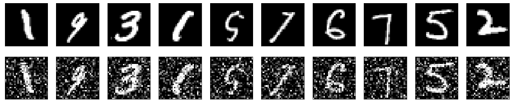
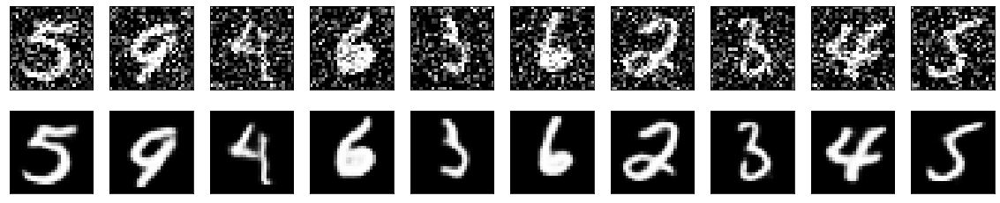
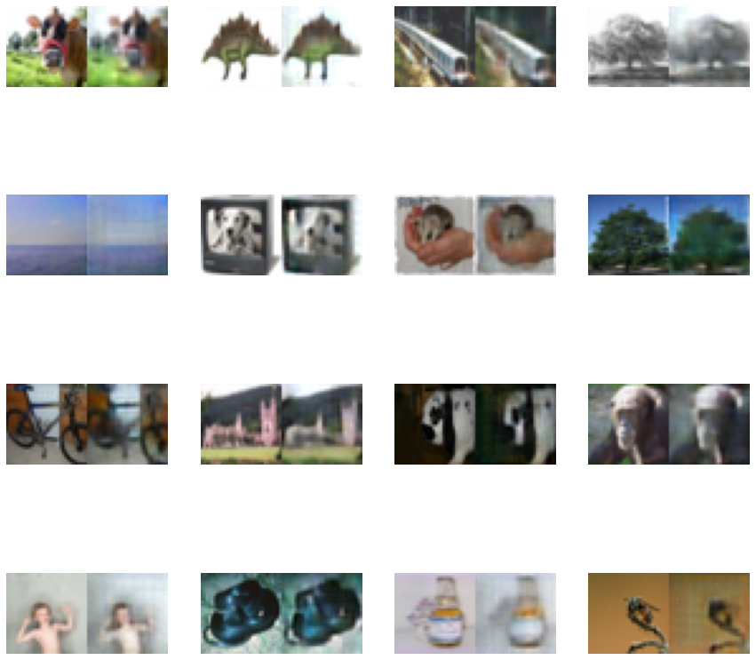
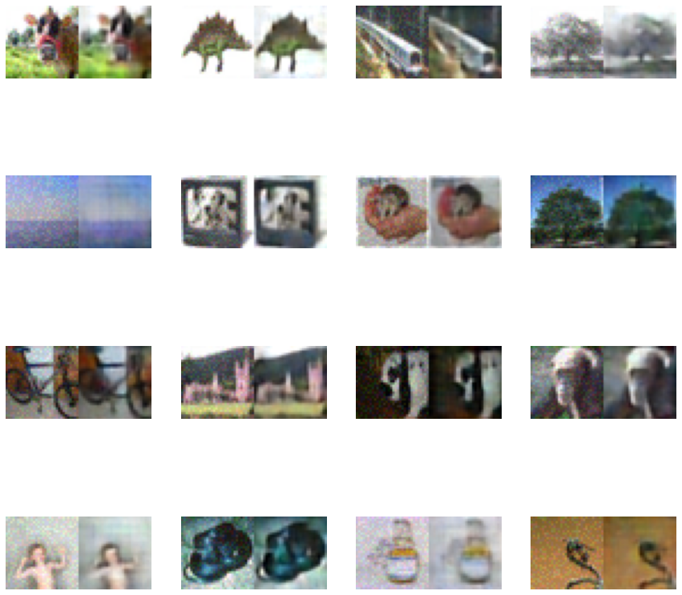

## Denoising Images with Deep Learning  
This repository contains a fully convolutional autoencoder for noise removal from images. Due to limited computational resources it contains model trained only for low resolutions, nevertheless, the same idea can be flawlessly extended to higher resolution domain. The pros of using deep learning is that it can be seamlessly applied to any kind of image if the training dataset is fine and it removes the need for hardcoding known techniques, namely wavelet transform, etc. into the model's working.  

### Results :  
 * **Grayscale : Dataset vs Noisy Samples** :  
   


 * **Grayscale : Noisy samples vs Reconstructed Images** :  
 


 * **Color : Original Image Reconstructions** :
   


 * **Color : Noise Removal** :
 

The reconstucted images shown above are blurred due to computational constraints on the model architecture.  
**PS** : The saved model can be found in ```model``` directory and it is recommended to run the code in ```Google Colab``` to prevent dangling dependencies.
